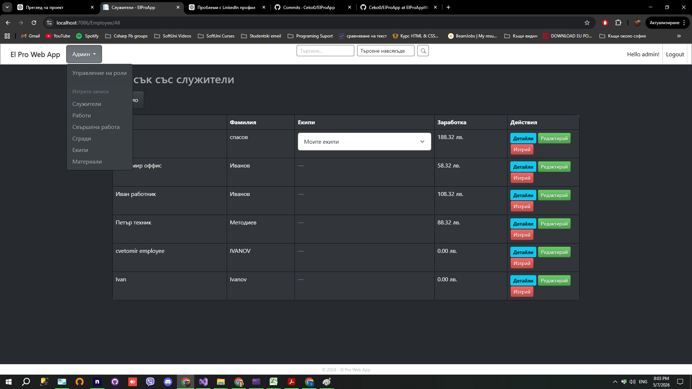
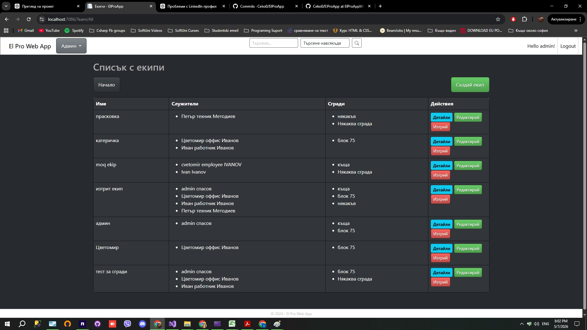

# ElPro Management System

Web-based business management system built with ASP.NET Core MVC and Entity Framework Core.

The application is designed to manage employees, teams, buildings, materials and completed work activities through a structured admin system and relational database architecture.

---

## Features

- Authentication and authorization
- ASP.NET Core Identity integration
- Employee management
- Team management
- Building management
- Material management
- Job tracking system
- Admin panel
- CRUD operations
- Relational database structure
- Responsive dark UI design

---

## Technologies Used

- C#
- ASP.NET Core MVC
- Entity Framework Core
- MySQL
- ASP.NET Identity
- HTML5
- CSS3
- JavaScript
- LINQ

---

## Screenshots

### Authentication System


### Employee Management



### Team Management



---

## Project Structure

The project follows a layered architecture approach with:

- Controllers
- Services
- Repositories
- Entity Models
- View Models
- Entity Mapping
- Database Relationships

---

## Database

The application uses MySQL with Entity Framework Core for database management and relationships.

---

## Run Locally

### Requirements

Before running the project, make sure you have:

- .NET SDK installed
- Visual Studio 2022 or newer
- MySQL Server installed
- MySQL Workbench (optional)

---

### Installation

1. Clone the repository

```bash
git clone https://github.com/Ceko0/ElProApp.git
```

2. Open the solution in Visual Studio

3. Configure the MySQL connection string in:

```text
appsettings.json
```

Example:

```json
"ConnectionStrings": {
  "DefaultConnection": "server=localhost;port=3306;database=elprodb;user=root;password=YOUR_PASSWORD;"
}
```

4. Run Entity Framework Core migrations

```powershell
Update-Database
```

5. Start the application

---

## Planned Improvements

- Better mobile responsiveness
- Notifications system
- Export functionality
- Activity logging
- UI/UX improvements

---

## Author

Tsvetomir Ivanov

ASP.NET Developer focused on building web-based business management systems.
